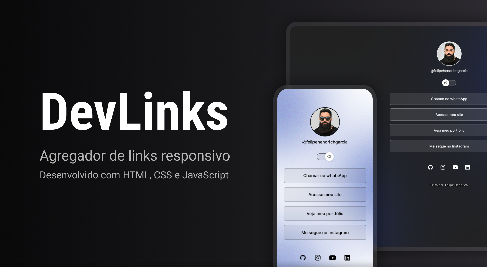

<h1 align="center"> DevLinks </h1>

Projeto de agregador de links desenvolvido para praticar fundamentos do desenvolvimento web.  

<a href="#projeto">Projeto</a>&nbsp;&nbsp;&nbsp;|&nbsp;&nbsp;&nbsp;
<a href="#tecnologias-utilizadas">Tecnologias</a>&nbsp;&nbsp;&nbsp;|&nbsp;&nbsp;&nbsp;
<a href="#funcionalidades">Funcionalidades</a>

 

## Projeto

O DevLinks é uma página de links personalizada, criada para praticar estruturação com HTML, estilização com CSS, interatividade com JavaScript e versionamento com Git e GitHub.

## Tecnologias utilizadas

- HTML
- CSS
- JavaScript
- Git
- GitHub
- Figma

## Funcionalidades

- Página de links personalizada
- Alternância de tema
- Ícones para redes sociais
- Layout responsivo

## Projeto online

- [Acesse o projeto finalizado, online](https://felipe-hendrich.github.io/devlinks-portfolio/)

## Aprendizados

Neste projeto, pratiquei:
- estruturação de páginas com HTML
- estilização e organização visual com CSS
- manipulação de interações com JavaScript
- uso de Git e GitHub para versionamento

## Créditos

Projeto desenvolvido com base no conteúdo Discover, da Rocketseat, com adaptações e personalizações realizadas durante a prática.
